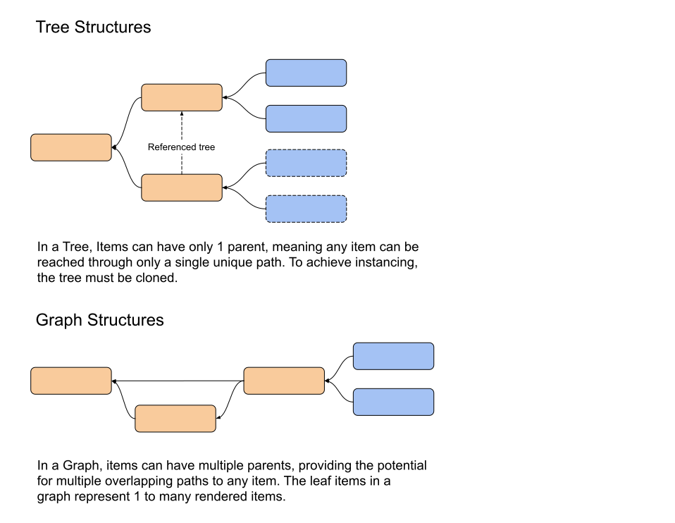
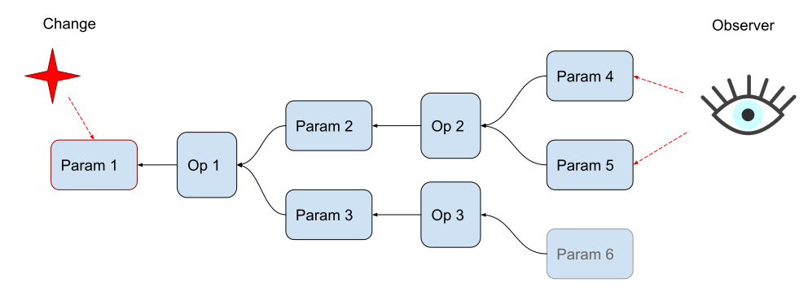
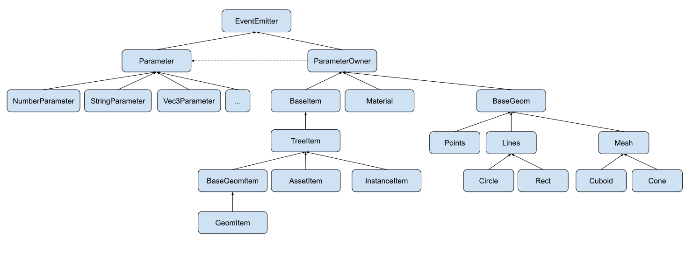

# Architecture Overview
Zea Engine is a web based visualization SDK for professional graphics applications. It was designed around 3 key motivations.

 * Performance
 * Versatility
 * Extensibility

In this article we explore the high level architecture of the engine and how the main parts relate to each other. 

## Performance
The architecture of Zea Engine enables high performance visualization by providing a highly optimized code path for WebGL based rendering. The Renderer / Scene Tree abstraction enables the renderer to build a rendering path optimized for efficient GPU utilization, while the scene tree provides a representation useful in the construction of large complex 3d scenes. 

## Versatility
Zea Engine was designed to follow the highly versatile and powerful scene representations found in high end Visual Effects packages like Autodesk Maya™ and Autodesk Softimage™. These tools were designed to support a wide range of requirements, and domains from Film VFX Production through to Design Visualization. A key goal of Zea Engine is to support a wide range of rendering requirements, complex motion driven by either predefined animation sequences, or procedural algorithms, and user interaction models. Being in the web space, Zea Leverages the simple yet powerful event model found in the browser, while adding a layer of tools for building 3d user interface widgets and interaction models.

## Extensibility
To allow an infinite number of use cases for Zea Engine, all aspects of the toolkit from the scene tree, interaction system and also the renderer support extension through plugins that can implement custom behaviors and features. The Scene Tree is a pluggable system that supports custom tree nodes to be added which can contain any type of data, expose custom functions, and provide interaction tools. These custom tree nodes can be persisted and restored like the builtin nodes and enable the scene tree to be extended to handle any data representation required. The Operator system that computes changes in the Scene Tree data is pluggable so custom procedural motion or effects can be implemented. The Renderer supports plugins that can take responsibility for displaying custom nodes in the tree, making it possible to integrate any custom rendering effects, while integrating with existing rendering solutions, and supporting features such as VR or AR.

# Scene Tree

*A simple scene tree containing a tree item, one geom Item, and an Asset containing a couple of Geom Items.*

The Scene tree structures the data that is rendered by the renderer. The Scene tree provides a hierarchy of nodes, each containing data in the form of Parameters, and potentially custom JavaScript objects.

> For more information on the main building block of the tree, please refer to the [TreeItem](api/SceneTree/TreeItem) documentation.

**Why a Tree and not a Graph**

Many scene descriptions and described as a Scene Graph, or even a Direct Acyclic Graph(DAG). A Graph is more flexible in that any item can have 1 or more parents. A Graph provides an elegant definition of instancing because it implies that any item in the Graph can have 1 or more transformations in the 3d scene. A scene tree, in contrast, implies that any tree item can have one and only one transformation in the 3d scene. While this constraint creates some limitations on how data can be organized, it simplifies many aspects of how a developer interacts with and understands the scene they are building.

## Parameters

Within the Scene Tree, each item in the tree contains a collection of parameters. Each parameter has a name and a value. Parameters can be added and removed from Tree items and provide a standard interface to access data stored within the tree.

Parameters provide a composition model for defining data storage in the scene. 

Parameters provide a standard interface to data stored in the scene tree. Parameters emit events when their values are changed, which allows user interfaces and other tools to observe the Parameters and respond to changes.

Parameters can also be displayed using ParameterWidgets, which are user interface components found in the zea-web-components library.

## Paths

Any item in the tree, or parameter can be reached by traversing the tree and accessing parameters. Each Tree item and Parameter can also return its path within the tree. 

In the following scene, a cylinder geometry is attached to a GeomItem which is nested under TreeItem1. The path for the Radius parameter is the following:

**[“Root”, “TreeItem1”,  “GeomItem”,    “Geometry”, “Radius”]** 

> Note: The names of parameters must not conflict with names of child tree items. So a child item could not have the name “GlobalXfo” because that would conflict with the parameter that exists no each Tree item. 

## Operators
Operators are used to compute new values for Parameters within the scene tree. Operators make the scene tree dynamic and able to maintain relationships between parameters, update based on changes, and drive animation. 

*In this diagram above, the value of Parameter C is calculated by Operator A using the values of Parameter A and Parameter B as inputs.*

## Lazy Evaluation
When a parameter is modified, by a user action or other mechanism such as a timer, the parameter emits a message to inform any connected operators that its value is now different, and the operators will need to calculate new values for the parameters connected to its outputs.

However, the operator does not immediately start this calculation. Instead it waits to see if anything in the system requires this new value of its outputs to be calculated. It does this by emitting a message to its outputs to tell them that their values have also changed. The parameters that receive this message simply set themselves as ‘dirty’ and emit their own message further into the scene tree.
These messages propagate throughout the tree until they reach an observer that is connected to a parameter and requests its updated value. 
On request, the operator requests the operators to finally calculate the updated value. Each operator asks it inputs for their values, which causes them to ask any input parameters for their values. This propagates back up the scene tree until it reaches the original operator whose value was modified.

> Parameter 1 is changed by some mechanism. Maybe a timer changes its value periodically or a user edits it using a user interface component.If Parameter 1 is changed, then Parameters 2 and 3 become ‘dirty’ and this propagates to 4, 5 & 6. An Observer, potentially the renderer, or another user interface component, is watching Parameters 4 & 5. It receives an event indicating that they have become dirty, so it retrieves their values. This causes Op 1 and then Op 2 to evaluate producing the new updated values for Parameters 4 & 5. No Observer is watching Param 6, so Op 3 is not evaluated and so Param 6 value is never calculated. Param 6 remains dirty until its value is needed.

### Benefits of Lazy Evaluation
Lazy evaluation enables connected observers like the Renderer, to batch evaluations of the scene tree at the frequency of rendering. This can lead to efficiencies as the scene does not get evaluated in between rendered frames. 
It can also be helpful if items are hidden from view, at which point, the renderer no longer requests their values. The value of hidden objects are not updated, unless something requests their value like a connected user interface. 

### Scene Tree Class Hierarchy

## Renderer
While the Scene tree provides a structure useful in organizing according to hierarchies useful for our understanding of the environment being displayed, the Renderer, through the system of passes, enables the organization of data around the requirements of efficient rendering on the GPU. Each Pass in the Renderer takes responsibility for rendering parts of the scene tree. The builtin passes generally handle the standard geometries that are provided in the scene tree, and custom passes can be registered to handle custom geometries that could be added to the scene tree.

*A simple scene tree containing a tree item, one geom Item, and an Asset containing a couple of Geom Items. The Renderer contains a collection of passes that are observing the various parts of the scene tree.*

## Renderer as an observer of the Scene Tree
The Renderer is implemented as an observer of the scene tree. The Scene Tree has no knowledge of the renderer and does not have access to rendering functionality. All rendering functionality is maintained in the Renderer, including the canvas element, the rendering context, all rendering specific data and shaders.

Whenever the scene tree changes in any way, the renderer receives events which allow it to respond to the changes, update rendering state and trigger redrawing to the canvas bound to the renderer.

## Passes
The renderer maintains a stack of passes that are each responsible for rendering different types of data found in the scene tree. When the Renderer binds to the scene tree, it traverses the tree and for each TreeItem, checks to see if any of its Passes would take responsibility for rendering that item.

### Pass Types
As passes are registered with the renderer, they are grouped according to 3 types. 

 * Opaque
 * Transparent
 * Overlay

**Opaque**
Opaque passes are always invoked first, and should render geometries that are not transparent in any way. Opaque passes have more flexibility in how they manage rendering, because blending is not applied. The GLOpaqueGeoms pass manages rendering standard Points, Lines and Mesh geometries and is the first pass to be invoked. It performs a rendering process that automatically draws instanced geometries, and is optimized to minimize Geometry, Material and Shader switches. 

> Note: The GLCADPass is a standard pass that is implemented as a plugin to the Renderer. The GLCADPass renders parametric BREP surfaces using a set of shaders and a highly custom rendering pipeline.

**Transparent**
Transparent passes are invoked after the Opaque passes have completed, and typically involve rendering geometries blended over the top of existing geometries.

Transparent geometries typically need to be rendered from back to front to achieve correct blending results. 

> Note: Each transparent pass should configure the GL blend modes before rendering.

The main pass for rendering transparent geometries is ‘GLTransparentGeomsPass’, which renders standard Points, Lines and Mesh geometries. It handles sorting the geoms according to their distance to the camera and switching materials and shaders if needed during the rendering process.

> Note: Each Transparent pass is rendered in sequence, so it is not possible to have transparent geometry from one pass depth sorted with geometries from another pass. This means, for example, that a label behind a glass window would appear over the top of the glass window, because the GLBillboards pass is invoked after the GLTransparentGeomsPass.

**Overlay**
Overlay passes are rendered after all Opaque and Transparent passes, and are used to render geometries that are considered ‘overlaid’ on the scene, and not occluded by scene geometry. This can include user interface geometry that should never be always visible regardless of its position in the 3d scene.

> Note: Geometry can be rendered using shaders that position geometry in the 2d coordinates of the viewport, and not 3d geometry projected onto the 2d surface using the camera's projection matrix.

> Note: The depth buffer is cleared before invoking the overlay passes. This prevents scene geometry from obscuring overlay geoms. However, Overlay geoms can obscure each other as the depth buffer is re-written.

## Adaptors

The Renderer uses a system of adapters to manage the relationship between the Objects and data stored in the Scene Tree and the memory on the GPU. For each type of Scene Tree item that is used in rendering, there is an adapter provided that manages the GPU resources for that object. 

> The role of the adaptor is to observe the data object, listen to changes, and update the GPU memory whenever necessary as the scene changes. If the data object is removed from the scene tree, the adaptor should clean up any GPU resources allocated for that object.

## Evented Rendering

Rendering only occurs when some part of the rendering system detects a change in the scene tree it is observing. Upon detection of a change, the renderer updates any rendering specific data and then redraws. When the Renderer is initially constructed, it requests the first frame to be rendered, after which evented rendering starts. 

> “In a static scene, If no user interaction occurs, then no rendering occurs.”

By only rendering in response to changes in the scene tree, the renderer strikes a balance between responsiveness and efficiency. This architecture means that rendering is not continuously occurring while the scene is static. In a static scene, meaning no animation or changes are being caused by external event systems like timers, then the renderer rests dormant waiting for a change until it receives its next change notification.

*Example: In a static scene, a user is viewing some large model and discussing with colleagues on a lightweight mobile device. The conversation might last 30 minutes. During the conversation, at different times, the user interacts with the scene a few times to change the position and orientation of the camera to focus on parts of the model. Rendering of the model only occurs during those interactions. The rest of the time the renderer is dormant consuming no resources, leading to longer battery life.
*

> “In a dynamic scene, rendering updates are triggered whenever the dynamic scene changes, or if the user interacts in some way”

**Example: In a heavy scene on a lightweight device, an animation is playing at a frequency of 20ms, or 50fps. The renderer can only render at a maximum of 40fps. During rendering of each frame, the scene can be considered ‘clean’, because the renderer has pulled all the relevant data and all operators are up to date. The scene then updates again before the rendering completes, and the renderer queues up another frame. A second time the scene may update, but the renderer has not yet cleaned the scene, so nothing changes. As soon as possible, the renderer starts rendering the subsequent frame, and will clean the scene.** 

In this way, the renderer and scene can update at independent frequencies. 

## Continuous Rendering
By comparison, maybe renderers, especially simple ones like Tree JS, or engines designed around the requirements of games, tend to render as fast as possible at all times. In Games, this is typically desired. The renderer in a game runs at a fixed 60fps at all times and usually the scenes are continuously changing and require re-rendering. The renderer frequency is not tied to user interactions, and instead on a simple timer and update loop.

When utilizing the WebXR api in Zea Engine, during a VR/AR session, the renderer switches to continuous rendering instead of evented rendering to ensure the smoothest experience.

## AR/VR
Zea Engine supports a wide range of AR and VR devices through the WebXR api available in most browsers today. Through WebXR, web based apps built using Zea Engine can leverage a very wide range of hardware. 

### Mobile/Cardboard VR
While the GPU on mobile devices are getting more powerful every year, they are still orders of magnitude slower than their desktop counterparts. However, for small simple scenes containing only a few thousand triangles, they are fast enough to deliver impressive virtual reality experiences. 

### Desktop VR
For a high end VR experience, there are a range of options such as the HTC Vive or Oculus Rift that work very well within the browser with Zea Engine. Full head and controller tracking is provided and the performance of Zea Engine enables quite amazing experiences to be built.

### Untethered AR
AR devices such as the microsoft Hololens is also supported by WebXR in the new Chromium Edge browser, enabling AR based apps to be build and deployed using only the web browser and Zea Engine. 

# Mobile
Support for mobile devices is improving as the browsers on those devices improve. Currently, Zea Engine support mobile devices, but some rendering features may not work on all devices. 
## iOS
iOS devices have typically provided far poorer support for WebGL than the equivalent Android devices. iOS has lagged behind Android in its support for WebGL, but we are anticipating this situation changing in the coming years.

### Zea CAD
The ZeaCAD extension uses start of the art rendering techniques to provide efficient and fast rendering of large CAD scenes. The rendering techniques require at least WebGL2 or later, and support for floating point textures, neither of which are supported by iOS(or desktop Safari). 

## Android
Android devices provide great support for WebGL through the installed chrome browser. However not all hardware provides the same level of functionality, and so each device must be tested individually.

## Microsoft Surface
The latest Microsoft surface hardware runs a full version of Windows 10 and so provide excellent support for Zea Engine and application built with it.

# Class Hierarchy

# Summary

In this section we explored the main architectural concepts of the engine, highlighting its design for performance, versatility, and customization.
