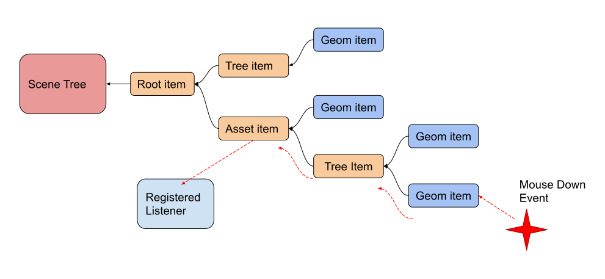
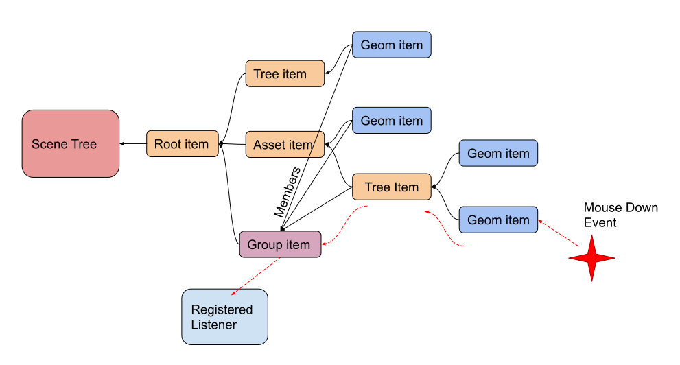

# Events and Listeners
Within the [DOM](https://developer.mozilla.org/en-US/docs/Glossary/DOM), events are emitted from DOM elements for various reasons, including notifying the consumer that an image has finished loading, or that a user has clicked on a certain element in the DOM tree. Developers can register listener functions to the DOM and determine appropriate responses to these events using JavaScript.

https://developer.mozilla.org/en-US/docs/Learn/JavaScript/Building_blocks/Events

The event system in the engine is modelled on and extends the event system found in the browser, giving developers a familiar model to understand how to interact with the Scene tree.

> All classes within the Scene Tree can emit events. The list of events emitted by any class is listed in its API documentation.

## The Canvas Element
The WebGL renderer is bound to a canvas element that lives in the DOM of a running web application. When a user interacts with the pages using the mouse or with a touch screen, events are emitted from the canvas element that the renderer is connected to. The Renderer uses these events to raycast into the scene and check for geometries directly under the mouse or touch location.

## Hit Testing Events

One of the services provided by the Viewport class, is translating 2d screen coordinates into 3d hits on geometries. For any coordinate on the 2d region of the viewport, a ray can be computed. The intersection of any geometries hit by that ray in the scene can be retrieved.
Mouse or touch interactions on the viewport are transformed into rays and resulting hit information is included in the events that are then propagated throughout the scene tree.

The goal of this design is to emulate the event system we find in the browser, where listeners can be registered with items in the tree to detect interactions relevant to those items.

## Event Propagation

There isn't automatic bubbling process in the zea engine tree to automatically propagate events up the tree. However, the scene tree does propagate a few events automatically up the tree.

?> pointerDown, pointerMove, pointerUp, pointerEnter and pointerLeave

These events which are received by the viewport directly from the canvas element to which it is bound, is then propagated up the tree of any geometry found directly under the pointer(Mouse, Touch, VR controller) event.

To detect if any item in a tree has been clicked on, users can register listeners directly to the items in the hierarchy.

!> The order of propagation starts from the Item itself, all the way up its hierarchy and finally reaching the viewport. If you want to prevent the event to reach further, just add `event.stopPropagation()` to your listener.

## Groups
Groups receive events from their members, and propagate them. So a user can detect if any item in a given group is clicked on by adding listeners directly to the group.

Example:

*The geom that was clicked on by the mouse emits the ‘pointerDown’ event, which is propagated by its parent. The Group receives the event from the parent, and propagates it. A ‘pointerDown’ listener registered on the group will then receive the event.*

Groups enable events to be aggregate from all members and propagated to any registered listeners.

## Summary

The event model in the engine should be familiar to web developers as it follows closely the design of events in the browser. By providing a low level event framework, developer can build higher level functionality according to their own specific requirements.

Here, we have a live demo with three event propagation and listener scenarios.
* The green square listens only to events triggered on itself.
* The yellow-ish cylinder and torus geometries represent group events listening.
* The blue cone listens to viewport events.

The label on top of each geometry display the events triggered.

If you want to understand more of how everything works, check the code in the live demo by clicking in the "View Source" button on the bottom-right par of the frame.

<!-- Copy and Paste Me -->

  <iframe
    src="https://glitch.com/embed/#!/embed/zea-demo-pointer-events?path=index.html&previewSize=100"
    title="zea-demo-pointer-events on Glitch"
    allow="geolocation; microphone; camera; midi; vr; encrypted-media"
    style="height: 100%; width: 100%; border: 0;">
  </iframe>

